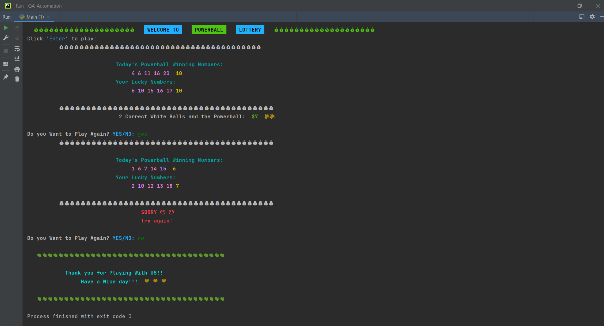

# ***.............................Powerball_Project.......................***

## 👨‍💻Author 
- VERSION: 1.0.0
- Dawit Samson Belay
- [Link To GitHub/Dawit Samson](https://github.com/DawitSamson)

## **⚡ This Project Generate a Powerball Lottery Ticket Numbers**

### 🔑 Keywords:
>* WhiteBall = The 5 numbers in the Ticket
>* PowerBall = The last numbers in the Ticket
>* Style.RESET_ALL = Resets foreground, background, and brightness used on our coding 
>* Fore.RED = This will make the Printout color(RED) 
>* Fore.RESET = Reset to default color used 
>* Fore.BACK = To make a Background color on printout
>* emojize = Converting Unicode emoji to emoji names
>* random.randint = Returns an integer number in list
>* random.sample = Returns a list with a random selection of a specified number of items from a list.
>* append = Adds an item to the end of the list

## **🖨️ How does This Powerball Project Work?**
* The Powerball works differently from the real one like Mega Millions to get more chances to get favorite results. 
* The Powerball  includes two parts. 
* Part, one includes 5 numbers. These five numbers are white ball numbers, which are drawn randomly from 20 numbers from 1 to 20 inclusively - (1,2,3, 4, 5, … , 17,18,19, 20). 	
* Part two only has one number, the Powerball number, which is obtained randomly from 10 numbers (1,2,3,4, 5,6,7,8, 9,10).
* When This Project run or reloaded/refreshed, it would display today’s Powerball winning numbers, your lucky numbers, and display the result based on lucky numbers against Today’s Powerball winning numbers. 

## ⚙ HOW TO USE:

* Open Pycharm 
* Run the code and click enter. 
* Will be display Today Winner Number and Lucky Numbers simultaneously Ticket.

## 📸 Screenshot

## 🤝 Winner Amount and Payment Rule
> - 5 Correct Balls and Powerball: Jackpot $324,000,000
>- 5 Correct White Balls, but no Powerball: $1,000,000
>- 4 Correct White Balls and Powerball: $10,000
>- 4 Correct White Balls, but no Powerball: $100
>- 3 Correct White Balls and Powerball: $100
>- 3 Correct White Balls, but no Powerball: $7
>- 2 Correct White Balls and Powerball: $7
>- 1 Correct White Ball and Powerball: $4
>- No White Balls, Just Powerball: $4
>- All Other situations – $0 

# 🛠️ Project Tools
>On this Project I used
>- Python Loops 
>- Python Functions
>- Python Arrays
>- Python Conditions
>- Object-oriented programming (OOP)
>- Python Package (emoji, colorama)
>- Importing on PyCharm

# 💻 Source
- Pycharm software
- GitHub 
- Google

### Have Fun!!! ☺️☺️☺️

